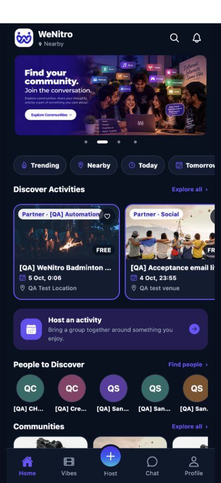
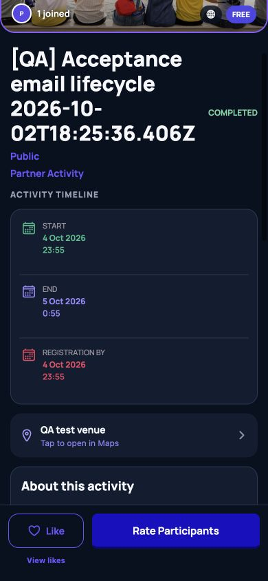
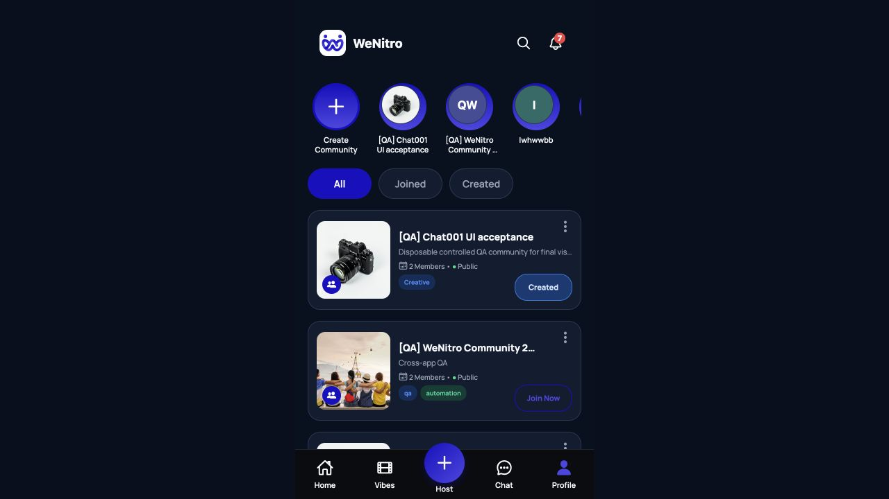
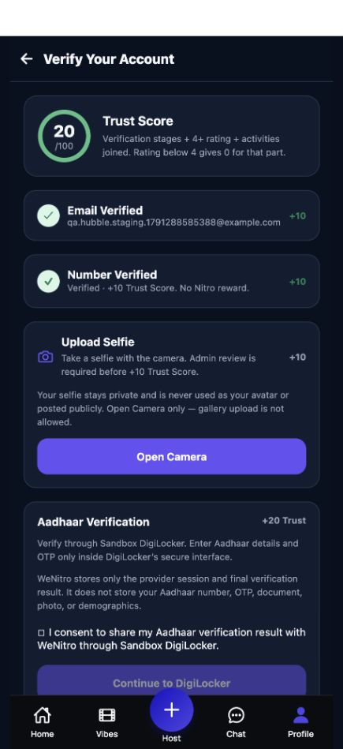
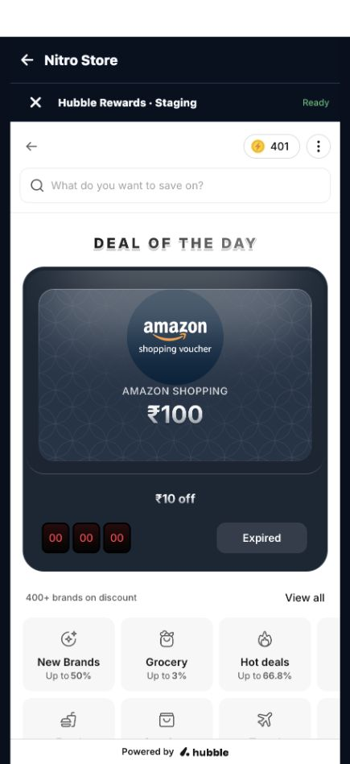
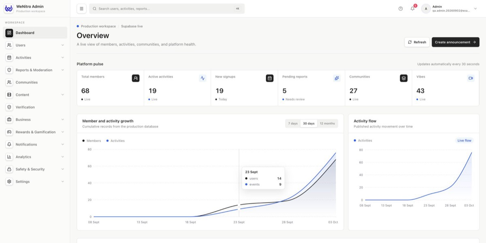
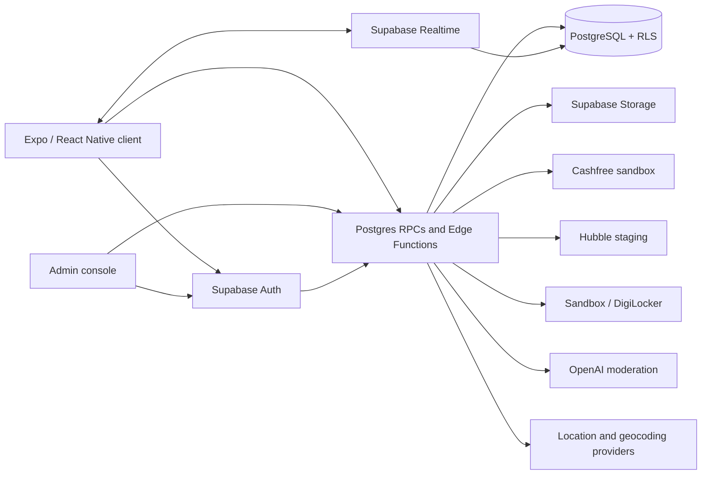

# WeNitro

**An activity-first social platform for meeting people through real-world experiences, communities, and shared interests.**

[](https://www.typescriptlang.org/)
[](https://docs.expo.dev/versions/v57.0.0/)
[](https://supabase.com/)
[](https://vercel.com/)

WeNitro combines activity discovery, hosting, communities, short-form media, chat, identity signals, and participation rewards in one Expo application. It is backed by a versioned Supabase/PostgreSQL system with Row Level Security, Realtime authorization, private media controls, transactional reward accounting, payment callbacks, and provider integrations.

**[Open the live app](https://wenitro-app.vercel.app/)** · **[Admin console](https://wenitro-admin-roan.vercel.app/)** (access controlled) · **[Source repository](https://github.com/dingdong-vamshi/WeNitro-eventhosting-community-app)**

## What it solves

Most social products optimize for passive consumption. WeNitro starts with something people can do together: find a nearby activity, host one, join a community, or invite a trusted Squad member. Profiles, verification, ratings, badges, and Nitro rewards provide context around participation without replacing the real-world interaction.

## Core product

- **Activities:** discovery, search and filters, location-aware results, hosting, invitations, registration questions, participant approval, Co-host permissions, activity chat, comments, likes, ratings, and completed-activity rules. Approved Partner Activities can use Cashfree-hosted checkout; ordinary paid Activities record an off-platform cost.
- **Social:** profiles, Squad relationships, Communities, Community Posts, 24-hour Stories, Vibes, and personal, group, Activity, and Community chat. Chat includes member-scoped group creation, polls with option-level voter attribution, blocking, reporting, and retained history rules.
- **Trust and identity:** provider-aware email/password, Google, and phone authentication; a server-derived Trust Score; phone OTP, live-selfie review, Sandbox/DigiLocker Aadhaar verification, social links, ratings, and a 22-badge progression engine.
- **Nitro and rewards:** an auditable Nitro ledger, idempotent earning rules, transaction history, Admin-controlled staging credits, and Hubble Money staging integration with short-lived RS256 SSO plus authenticated balance, atomic debit, and reversal callbacks.
- **Operations:** a companion Admin console for users, Activities, Communities, reports, verification, Partner workflows, announcements, feature controls, Nitro staging credits, and audit-oriented moderation views.

## Product preview

These screenshots were captured from the deployed web application and Admin console using controlled QA data.

<table>
  <tr>
    <td align="center"><a href="docs/screenshots/home.jpg"></a><br /><sub>Home and activity discovery</sub></td>
    <td align="center"><a href="docs/screenshots/activity.jpg"></a><br /><sub>Activity detail and participation</sub></td>
  </tr>
  <tr>
    <td align="center"><a href="docs/screenshots/community.jpg"></a><br /><sub>Communities</sub></td>
    <td align="center"><a href="docs/screenshots/verification.jpg"></a><br /><sub>Trust Score and verification</sub></td>
  </tr>
  <tr>
    <td align="center"><a href="docs/screenshots/rewards.jpg"></a><br /><sub>Hubble rewards catalogue (staging)</sub></td>
    <td align="center"><a href="docs/screenshots/admin.jpg"></a><br /><sub>Access-controlled Admin console</sub></td>
  </tr>
</table>

## Engineering highlights

### Authorization is enforced below the UI

Supabase Auth identities are mapped to application profiles, while PostgreSQL RLS and narrowly scoped RPCs enforce ownership and role checks. Sensitive operations such as private Activity access, participant management, comments, chat membership, anonymous-author audit, verification, reports, and Admin actions are rejected server-side when the caller is not authorized.

### Reward and payment state is transactional

Nitro uses a transaction ledger rather than a client-controlled balance. Hubble debits and reversals are atomic, reference-idempotent, and concurrency tested. Cashfree order creation, verification, and signed webhooks keep Partner admission dependent on a verified provider result and preserve retry safety.

### Identity flows reconcile provider state

Google, email/password, phone-only, and linked identities share the same application account model. Phone changes use the authenticated phone-change contract, verify the same normalized number, reject cross-account ownership, and reconcile the authoritative Auth result after uncertain network outcomes. Verification contributes to Trust Score once; it does not mint Nitro.

### Privacy is part of the data model

Anonymous Community content hides author identity from members while preserving authorized moderation access. Anonymous media uses opaque, expiring capabilities instead of exposing uploader-identifying storage paths. Selfie and Aadhaar flows store only the minimum application state, and diagnostic logging excludes OTPs, Aadhaar numbers, access tokens, and secrets.

### Provider failures have explicit outcomes

Edge Functions bound external requests, validate callback signatures and response shapes, and distinguish retryable, rejected, and review states. OpenAI moderation covers text and owned images; provider outages send content to review instead of publishing it. Hubble and Cashfree callbacks reconcile against the database rather than trusting client state.

## Architecture



The client contains presentation and interaction state. Authorization, financial mutations, verification projection, privacy boundaries, and moderation decisions live in PostgreSQL functions, RLS policies, or Edge Functions.

## Tech stack

| Area | Technology |
| --- | --- |
| Client | React 19, React Native 0.86, Expo SDK 57, TypeScript |
| Navigation and device APIs | React Navigation, Expo Location, Image Picker, Secure Store, Video |
| Backend | Supabase Auth, Edge Functions (Deno/TypeScript), PostgreSQL RPCs |
| Data and security | PostgreSQL, Row Level Security, triggers, versioned migrations |
| Realtime and media | Supabase Realtime, private/public Storage buckets, signed URLs |
| Payments and rewards | Cashfree sandbox, Hubble Money staging, Nitro ledger |
| Identity and safety | Google Sign-In, phone OTP, Sandbox/DigiLocker, OpenAI moderation |
| Deployment | Vercel for the web client, Supabase for data and server functions |
| Testing | Node assertion suites, Deno tests, disposable PostgreSQL integration tests, Playwright |

## Try the demo

Open **[wenitro-app.vercel.app](https://wenitro-app.vercel.app/)** and create a standard member account with email or Google Sign-In.

Shared passwords are intentionally not committed: the live deployment is backed by the active application environment, and the Admin console has real operational privileges. A seeded, disposable reviewer account or restricted Admin walkthrough is available on request.

For a quick review:

1. Browse and filter Activities from Home.
2. Open an Activity to inspect its timeline, host, participants, and chat entry points.
3. Explore Communities and Vibes.
4. Open Chat to see personal, group, Activity, and Community conversations.
5. Open Profile to inspect Trust Score, badges, history, and verification states.
6. Open Nitro Store to view Hubble staging eligibility and the rewards catalogue.

Provider flows are marked sandbox or staging. Do not enter real payment or identity information for a portfolio review.

## Local development

Use Node.js 22 and the versioned [Expo SDK 57 documentation](https://docs.expo.dev/versions/v57.0.0/).

```bash
git clone https://github.com/dingdong-vamshi/WeNitro-eventhosting-community-app.git
cd WeNitro-eventhosting-community-app
npm ci
cp .env.example .env.local
npm run web
```

The web client needs these public values in `.env.local`:

```dotenv
EXPO_PUBLIC_SUPABASE_URL=
EXPO_PUBLIC_SUPABASE_PUBLISHABLE_KEY=
EXPO_PUBLIC_CASHFREE_MODE=sandbox
EXPO_PUBLIC_GOOGLE_WEB_CLIENT_ID=
EXPO_PUBLIC_GOOGLE_IOS_CLIENT_ID=
EXPO_PUBLIC_GOOGLE_PLACES_ENABLED=false
```

Provider secrets, service-role credentials, webhook secrets, RSA private keys, and moderation keys belong in the server environment. They must never use the `EXPO_PUBLIC_` prefix.

Useful checks:

```bash
npm run typecheck
npm run vercel-build
node scripts/client-readiness-contract-test.mjs
node scripts/verification-hubble-reconciliation-test.mjs
```

The repository also includes focused Edge Function tests and PostgreSQL behavior suites. Database suites create disposable local clusters and require `initdb`, `pg_ctl`, and `psql` on `PATH`; production QA scripts are intentionally separate because some create scoped test records.

## Repository map

```text
src/components/          Product screens and reusable UI
src/services/            Authenticated client/service adapters
src/domain/              Product rules and pure domain logic
supabase/functions/      Provider-facing and privileged server endpoints
supabase/migrations/     Versioned schema, RPC, trigger, and RLS changes
scripts/                 Regression, integration, security, and QA checks
docs/                    Architecture, acceptance, and deployment evidence
```

## What building this required

WeNitro required designing complete product flows across client state, authentication, database authorization, provider callbacks, and operational tooling. The most valuable work was at those boundaries: reproducing cross-provider identity failures, making payments and rewards idempotent under retries, preserving privacy while keeping moderation auditable, and validating fixes against both local disposable databases and deployed provider behavior.

The project demonstrates product engineering across React Native UI, TypeScript service design, PostgreSQL/RLS authorization, distributed transaction handling, third-party integrations, production debugging, and release verification.

## Security and privacy

- RLS and server-owned RPCs protect sensitive reads and mutations.
- Nitro, payment, verification, and Admin decisions are server-authoritative.
- Financial callbacks use signature/secret validation and idempotent references.
- Private media uses scoped Storage access and signed or opaque delivery paths.
- OTPs, Aadhaar numbers, private keys, access tokens, and provider secrets are excluded from application logs and source control.

See [`.env.example`](.env.example) for public client variable names. It contains no operational credentials.

## Project status

The responsive web application is deployed and the Expo project is configured for iOS and Android development builds. Cashfree Partner checkout is configured for sandbox testing. Hubble reward redemption is integrated against the staging environment; production activation is environment-configurable when production credentials are issued. Sandbox/DigiLocker identity verification remains provider-dependent.

The Admin console is a separate, access-controlled deployment and is not offered with public credentials.

## License

[MIT](LICENSE)
